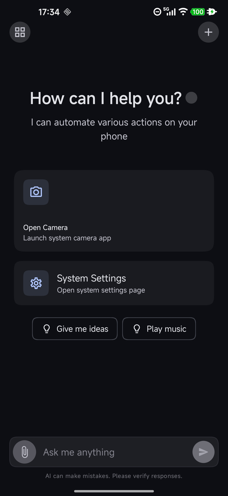
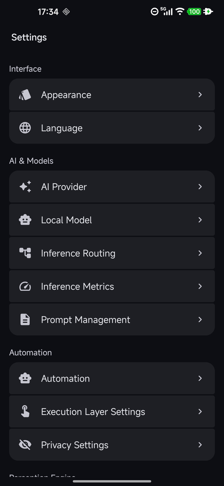
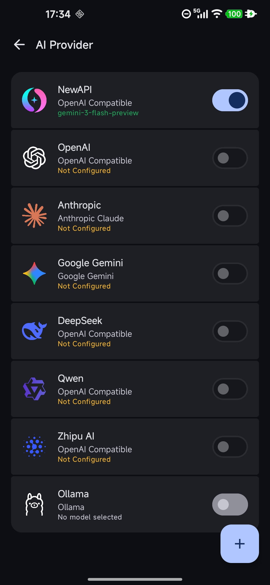
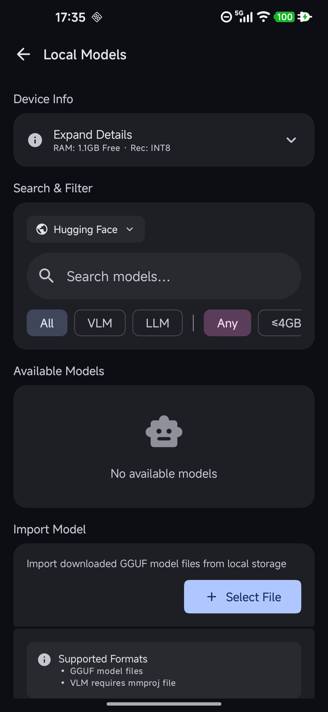
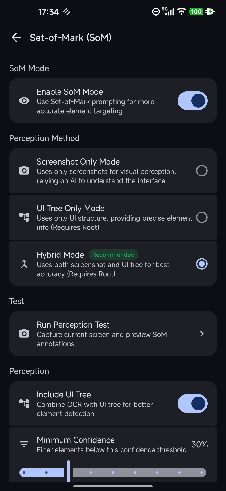
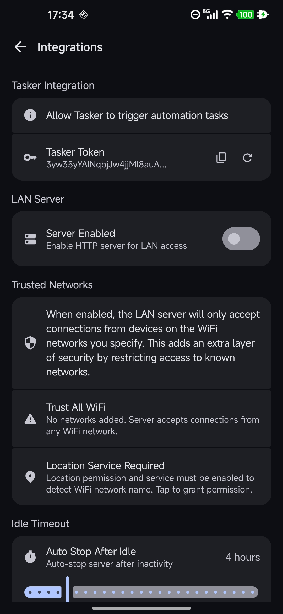

# Futon

[English](README.md) | [中文](README_zh.md)

<p align="center">
  
</p>

<h1 align="center">Futon</h1>
<h3 align="center">Run on Futon. Sleep on your Futon</h3>

<p align="center">
  一个 Android AI Agent（玩具），结合原生 C++ 守护进程与 AI 能力。
</p>

<p align="center">
  <a href="https://github.com/iFleey/Futon/releases"></a>
  <a href="LICENSE"></a>
  
  
</p>

## 简介

Futon 是一个面向 Android 平台的 AI Agent，无需借助外部设备，支持使用云端提供商与本地模型。

Futon 采用双层架构：底层守护进程负责屏幕捕获、推理引擎和输入注入；上层 Client 应用提供用户界面和 AI 服务集成。

## 截图

| 主页                            | 设置                            | AI 提供商                            |
|-------------------------------|-------------------------------|-----------------------------------|
|  |  |  |

| 本地模型                            | SoM 感知                            | 集成                            |
|---------------------------------|-----------------------------------|-------------------------------|
|  |  |  |

## 快速开始

> [!IMPORTANT]
>
> 请注意：
>
> Futon 是一个验证性原型（Proof of Concept），它目前**不具备**生产级语言所需的稳定性、安全性审计与明确的长期支持。
> 请勿将生成的二进制文件用于任何生产环境或关键任务系统。
>
> Futon 目前且长期**仅支持** ROOT 设备。

### 1. 安装应用

从 [Releases](https://github.com/iFleey/Futon/releases) 下载最新 APK 并安装。

### 2. 授予 ROOT 权限

首次启动时，应用会请求 ROOT 权限以部署守护进程。

### 3. 部署守护进程

应用会自动将 ROOT 模块部署到 `/data/adb/modules/futon_daemon`，包含：

- SELinux 策略补丁
- 守护进程二进制文件

### 4. 配置安全密钥

应用将自动配置安全密钥，作为 ROOT 级别的应用，Futon 为此引入了大量安全机制，详见 [Security Model](./SECURITY.md)

### 5. 配置 AI 提供商或本地模型

进入设置页面，配置 AI 提供商的 API Key，或根据设备情况安装本地模型。

## 构建指南

### 环境要求

| 工具          | 版本     |
|-------------|--------|
| JDK         | 21     |
| Android SDK | API 36 |
| NDK         | r29    |
| CMake       | 3.22+  |
| Gradle      | 9.2+   |

### 构建应用

```bash
# Debug 构建
./gradlew assembleDebug

# Release 构建 (需要配置 keystore.properties)
./gradlew assembleRelease

# 运行单元测试
./gradlew test
```

> [!TIP]
>
> Client APP 在 Release 环境下启动 daemon 会对 Client APP 进行签名校验，可通过附加 `--skip-sig-check` 启动 daemon
> 以跳过检查（Debug 环境自动附加该 flag）。

### 构建守护进程

```bash
cd daemon
mkdir build && cd build

cmake -B build \
    -DCMAKE_BUILD_TYPE=Release \
    -DANDROID_ABI=arm64-v8a \
    -DANDROID_PLATFORM=android-30

make -j$(sysctl -n hw.ncpu)
```

> [!NOTE]
>
> 守护进程二进制文件会通过部署合约系统自动嵌入 APK。
>
> 同时，为确保 Client APP 与 daemon 版本的契合，两者将基于 [deployment_rules.json](deployment-rules.json) 进行校验。
>
> 具体原理与流程，请详见 [docs/deployment-contract.md](docs/deployment-contract.md)。

### 快速调试

对 daemon 的调试可不依赖于 ROOT 管理器。以下步骤基于 adb shell 进行：

> [!TIP]
>
> 请在 ROOT 管理器中授予 Shell 权限以满足调试。

```bash
cd daemon/build

# 终止已启动的 daemon
adb shell su -c "pkill -9 futon_daemon"

# 推送到缓存目录
adb push futon_daemon /data/local/tmp/

# 更替为新的 daemon
adb shell su -c "cp /data/local/tmp/futon_daemon /data/adb/futon/futon_daemon"

# 授予 daemon 权限
adb shell su -c "chmod 755 /data/adb/futon/futon_daemon"
```

### 签名配置

创建 `keystore.properties` 文件：

```properties
storeFile=path/to/your.keystore
storePassword=your_store_password
keyAlias=your_key_alias
keyPassword=your_key_password
```

## 贡献指南

请参阅 [CODE_OF_CONDUCT.md](CODE_OF_CONDUCT.md)、[CONTRIBUTING.md](CONTRIBUTING.md) 以了解：

- 行为准则
- 代码风格规范
- 提交流程
- 署名规则
- 版权归属

## 致谢

在此特别致谢：

- @Caniv

  参与 Futon 的图标设计，并绘制了当前的图标。

- 胡斯凯

  参与了 Futon 的早期图标设计。

- [PPOCRv5-Android](https://github.com/iFleey/PPOCRv5-Android)

  Futon 基于 PPOCRv5 模型，进行了大量自己的量化与封装，模型与具体应用见 Fleey 发布的 PPOCRv5-Android。

- [PaddleOCR](https://github.com/PaddlePaddle/PaddleOCR)

  PP-OCRv5 模型

- [LiteRT](https://ai.google.dev/edge/litert)

  端侧 ML 运行时

- [Abseil](https://abseil.io/)

  C++ 通用库

## 许可证

源代码采用 [GNU General Public License v3.0](LICENSE) 许可。

```
Futon - Android Automation Daemon, Futon Daemon Client, ...
Copyright (C) 2025 Fleey

This program is free software: you can redistribute it and/or modify
it under the terms of the GNU General Public License as published by
the Free Software Foundation, either version 3 of the License, or
(at your option) any later version.

This program is distributed in the hope that it will be useful,
but WITHOUT ANY WARRANTY; without even the implied warranty of
MERCHANTABILITY or FITNESS FOR A PARTICULAR PURPOSE.  See the
GNU General Public License for more details.

You should have received a copy of the GNU General Public License
along with this program.  If not, see <https://www.gnu.org/licenses/>.
```

> [!IMPORTANT]
>
> 商标与 Logo 政策
>
> Futon 名称和 Logo 是受保护的资源，不受 GPLv3 许可证覆盖。
>
> - Fork 项目**必须**移除官方品牌资源，无论是否商业用途
> - 删除 `branding/official/` 目录
> - 更改应用名称和包名
> - 更新 `daemon/core/branding.h` 中的标识
>
> 详见 [COPYRIGHT](COPYRIGHT) 和 [branding/README.md](branding/README.md)。
