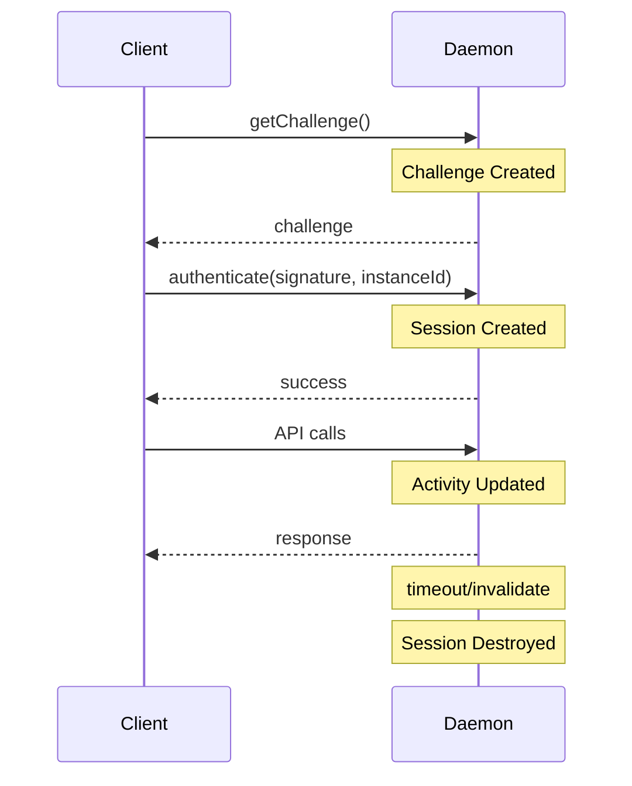

# Security Model

Futon is a GPLv3 open source project. This document explains the security model
designed for an environment where all source code is publicly visible.

## Open Source Security Philosophy

In open source software, "security through obscurity" is ineffective because:

- All source code is publicly readable
- Hardcoded secrets can be extracted by anyone
- Anti-debugging measures can be commented out and recompiled

Instead, Futon relies on:

1. User-Provisioned PKI - Keys generated on-device, verified with Android Key Attestation
2. Cryptographic verification - Challenge-response authentication with hardware-backed keys
3. Operating system-level permissions - UID verification via Binder IPC
4. User-controlled authorization - All config files are user-editable

## GPLv3 Compliance

### User-Configurable Authorization

Authorization settings are stored in user-editable files under `/data/adb/futon/`:

| File                       | Purpose                                       |
|----------------------------|-----------------------------------------------|
| `authorized_package.txt`   | Authorized app package name (legacy/fallback) |
| `authorized_signature.txt` | Authorized APK signature (legacy/fallback)    |
| `keys/`                    | User-Provisioned PKI keys directory           |

Users who fork and modify this software can authorize their own builds by
editing these files or deploying their own keys. This is required by GPLv3 Section 6.

### How to Authorize a Custom Build

#### Option 1: User-Provisioned PKI (Recommended)

The app automatically provisions keys via Root when first launched. For custom builds:

1. Generate EC P-256 key pair in Android KeyStore (with Key Attestation)
2. Export public key + attestation certificate chain
3. Deploy to `/data/adb/futon/keys/<key_id>.key` via Root
4. Daemon verifies attestation before trusting the key

#### Option 2: Legacy Configuration Files

For builds without Key Attestation support:

```bash
# Create config directory (if not exists)
mkdir -p /data/adb/futon

# Authorize your package name
echo "com.yourname.yourfork" > /data/adb/futon/authorized_package.txt

# Authorize your APK signing certificate (SHA-256 fingerprint)
echo "your_apk_signature_sha256_hex" > /data/adb/futon/authorized_signature.txt
```

### Compile-Time Security Options

Security features can be disabled at compile time:

```cmake
# In daemon/CMakeLists.txt
option(FUTON_ENABLE_SECURITY "Enable all security modules" ON)
option(FUTON_ENABLE_ANTI_DEBUG "Enable anti-debugging detection" ON)
option(FUTON_ENABLE_DEVICE_BINDING "Enable device fingerprint binding" ON)
option(FUTON_ENABLE_INTEGRITY_CHECK "Enable integrity verification" ON)
```

Users building from source can disable any security feature. This is intentional
and required by GPLv3 (no technical measures to restrict modification).

## Authentication Flow

### 1. User-Provisioned PKI (Primary Security)

This is the primary security mechanism. The trust root is generated on-device,
not pre-embedded by the developer.

Key Generation Flow:

1. App generates EC P-256 key pair in Android KeyStore (TEE/StrongBox)
2. Private key NEVER leaves the device (hardware-protected)
3. App exports public key + Key Attestation certificate chain
4. App uses Root to write public key to `/data/adb/futon/keys/<key_id>.key`
5. Daemon validates Key Attestation before trusting the key

Why Key Attestation?

Android Key Attestation provides cryptographic proof that:

- The key was generated in hardware (TEE or StrongBox) on THIS device
- The key belongs to a specific app (verified by package name + APK signature)
- The device has verified boot and locked bootloader (optional checks)

This prevents:

- Malicious Root apps from impersonating the official app
- Software-generated keys from being accepted
- Keys extracted from other devices

Key Trust Levels:

| Trust Status          | Description                                     |
|-----------------------|-------------------------------------------------|
| `PENDING_ATTESTATION` | Key added, waiting for attestation verification |
| `TRUSTED`             | Attestation verified, key is fully trusted      |
| `REJECTED`            | Attestation failed, key cannot be used          |
| `LEGACY`              | Legacy key without attestation (less secure)    |

Key File Format:

```
/data/adb/futon/keys/<key_id>.key

key_id=<SHA-256 of public key>
algorithm=EC_P256
public_key=<hex-encoded DER public key>
created_at=<unix timestamp>
last_used_at=<unix timestamp>
trust_status=TRUSTED
attestation_verified=true
attestation_package=me.fleey.futon
attestation_signature=<hex-encoded APK signature>
attestation_security_level=2
is_active=true
```

### 2. Challenge-Response Authentication

After key provisioning, authentication uses challenge-response:

1. Client calls `getChallenge()` to get a random 32-byte challenge
2. Daemon generates challenge, encrypts it in memory with session key
3. Client signs the challenge with its private key (ECDSA-P256)
4. Client calls `authenticate(signature, instanceId)`
5. Daemon verifies signature against whitelisted keys
6. On success, a session is created

Security Properties:

- Challenge is single-use and expires after 30 seconds
- Challenges are encrypted in memory (defense-in-depth)
- Only the holder of the private key can authenticate
- Private key never leaves Android KeyStore (hardware-protected)

Multi-Key Support:

The daemon can verify signatures against multiple whitelisted keys. This allows:

- Key rotation without service interruption
- Multiple authorized apps (for custom builds)
- Graceful key revocation

### 3. UID-Based Verification

The daemon verifies callers using `Binder.getCallingUid()`, which is enforced
by the Android kernel and cannot be spoofed without kernel-level access.

Caller Verification Checks:

- UID matches the authenticated session
- Package name matches authorized list (optional)
- APK signature matches authorized list (optional)

### 4. Session Management

Session Properties:

- Timeout: 5 minutes of inactivity (configurable)
- Single session: Only one active session at a time
- UID-bound: Sessions are tied to the client's UID
- Activity tracking: Timeout resets on each API call

Session Lifecycle:



## Rate Limiting

To prevent brute-force attacks and abuse:

Configuration:

- Maximum failures: 5 attempts before lockout
- Initial backoff: 1 second
- Maximum backoff: 10 minutes
- Backoff multiplier: 2.0 (exponential)
- Reset window: 15 minutes

Lockout Behavior:

| Failed Attempts | Lockout Duration  |
|-----------------|-------------------|
| 1               | 1 second          |
| 2               | 2 seconds         |
| 3               | 4 seconds         |
| 4               | 8 seconds         |
| 5+              | 16s -> 10 minutes |

Per-UID Tracking:

- Each UID (app) has independent rate limiting
- Successful authentication resets the counter
- Expired entries are cleaned up after 15 minutes of inactivity

Rate Limit Bypass:

Rate limiting can be disabled at compile time or runtime:

```cpp
// In daemon/main.cpp
auth_config.enable_rate_limiting = false;
```

This is intentional for GPLv3 compliance - users can modify security policies.

## Environment Detection (Telemetry Only)

The daemon can detect debugging/instrumentation environments for telemetry purposes only:

Detection Capabilities:

| Detection Type | Method                                 | Action      |
|----------------|----------------------------------------|-------------|
| Debugger       | TracerPid check in `/proc/self/status` | Log warning |
| Frida          | Port scan (27042-27045), thread names  | Log warning |
| Xposed/LSPosed | Library scanning, file path checks     | Log warning |

Important Limitations:

> [!IMPORTANT]
>
> These checks are for telemetry and logging only, NOT security boundaries.
> An attacker with source code can:
>
> - Comment out detection code and recompile
> - Patch the binary to skip checks
> - Hook detection functions with Frida/Xposed
>
> Real security comes from cryptographic verification (Key Attestation + Challenge-Response),
> not environment detection.

Why Include Detection?

1. Debugging aid - Helps developers identify test environments
2. Telemetry - Understand deployment environments
3. User awareness - Log warnings for unexpected environments

Disabling Detection:

```cmake
# In daemon/CMakeLists.txt
option(FUTON_ENABLE_ANTI_DEBUG "Enable anti-debugging detection" OFF)
```

Or at runtime:

```cpp
// In daemon/main.cpp
auth_config.enable_caller_verification = false;
```

## File Paths

All daemon files are stored under `/data/adb/futon/`:

```
/data/adb/futon/
├── futon_daemon              # Daemon binary
├── daemon.log                # Daemon log file
├── security.log              # Security audit log
├── seccomp_violations.log    # Seccomp syscall violations (if any)
├── authorized_package.txt    # Authorized package name (user-editable)
├── authorized_signature.txt  # Authorized APK signature (user-editable)
├── .pubkey_pin               # Pinned public key fingerprint
├── keys/                     # User-Provisioned PKI keys directory
│   └── <key_id>.key          # Public key files (auto-deployed by app)
└── models/                   # ML models directory
    ├── ocr_det_fp16.tflite   # PPOCRv5 detection model
    ├── ocr_rec_fp16.tflite   # PPOCRv5 recognition model
    └── keys_v5.txt           # Character dictionary
```

## Reporting Security Issues

Please report security vulnerabilities privately via GitHub Security Advisories
or by contacting the maintainer directly. Do not open public issues for
security vulnerabilities.

Repository: https://github.com/iFleey/Futon
