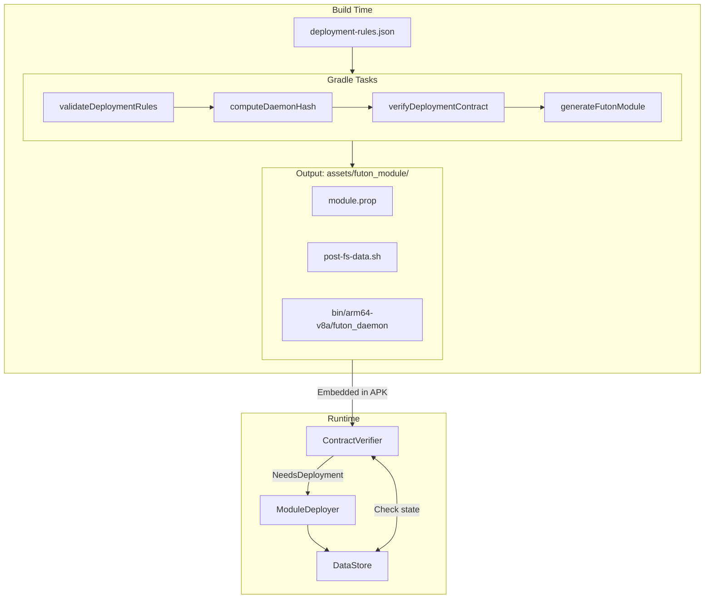
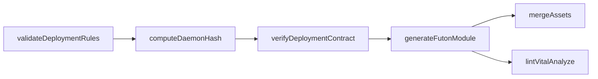
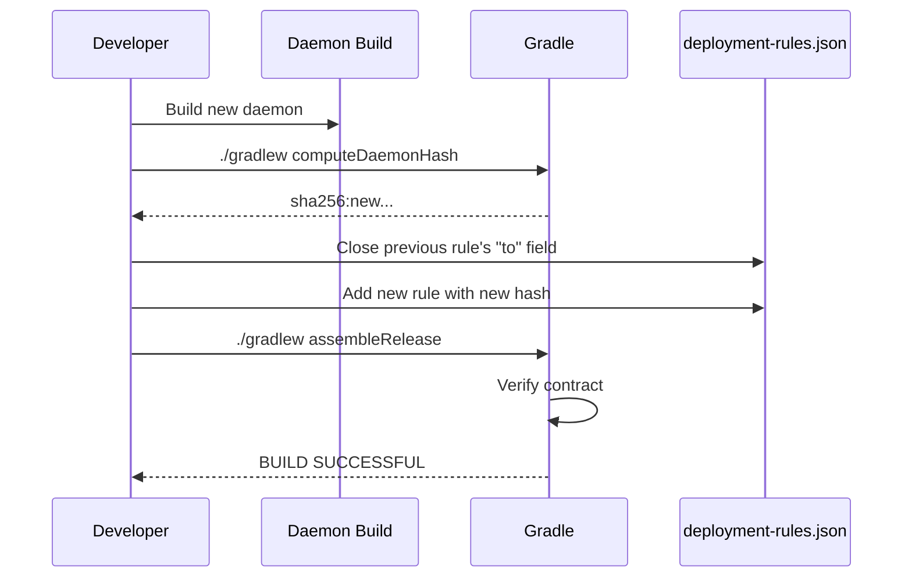
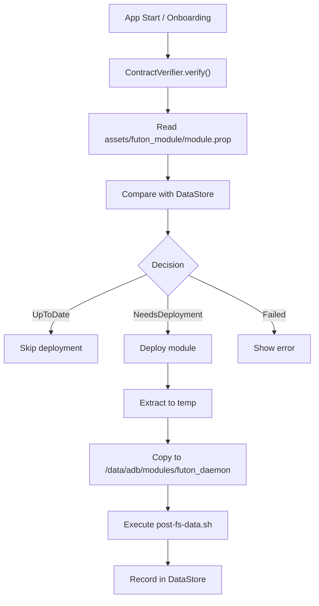

# Futon Deployment Contract System

## Overview

The deployment contract system ensures that the correct version of the daemon binary is deployed for
each app version.

Core capabilities:

- Build-time validation: Ensures daemon hash matches expected value before APK is built
- Runtime verification: Checks if deployed module matches expected contract
- Automatic deployment: Installs/updates module when needed

## Architecture



## Files

### deployment-rules.json

The contract rules file, located at project root.

```json
{
  "rules": [
    {
      "comment": "Initial release",
      "appVersionRange": {
        "from": 1,
        "to": null
      },
      "module": {
        "daemonHash": "sha256:abc123...",
        "moduleVersion": 1
      }
    }
  ],
  "architectures": [
    "arm64-v8a"
  ]
}
```

| Field           | Description                                                     |
|-----------------|-----------------------------------------------------------------|
| `from`          | Starting versionCode (inclusive)                                |
| `to`            | Ending versionCode (inclusive), `null` means open-ended         |
| `daemonHash`    | SHA256 hash of daemon binary, or `sha256:pending` for new rules |
| `moduleVersion` | Module version code (increment when SELinux policies change)    |

### module.prop.template

Template for generating module.prop, located at `su-module/module.prop.template`.

```properties
id=futon_daemon
name=Futon Daemon
version=${MODULE_VERSION}
versionCode=${MODULE_VERSION_CODE}
author=Futon
description=SELinux policies and daemon management for Futon
# Deployment Contract (auto-generated)
daemonHash=${DAEMON_HASH}
daemonArch=${DAEMON_ARCH}
appVersionFrom=${APP_VERSION_FROM}
appVersionTo=${APP_VERSION_TO}
generatedAt=${GENERATED_AT}
```

## Gradle Tasks



| Task                     | Command                              | Description                  |
|--------------------------|--------------------------------------|------------------------------|
| validateDeploymentRules  | `./gradlew validateDeploymentRules`  | Validate rules file format   |
| computeDaemonHash        | `./gradlew computeDaemonHash`        | Calculate daemon binary hash |
| verifyDeploymentContract | `./gradlew verifyDeploymentContract` | Verify hash matches rules    |
| generateFutonModule      | `./gradlew generateFutonModule`      | Generate complete module     |

Build will fail if:

- No rule matches current versionCode
- Daemon hash doesn't match expected hash (unless `allowPendingHash = true`)

## Configuration

The plugin auto-configures from the Android extension:

| Setting          | Source                                 | Description                           |
|------------------|----------------------------------------|---------------------------------------|
| versionCode      | `android.defaultConfig.versionCode`    | App version code                      |
| architecture     | `android.defaultConfig.ndk.abiFilters` | First ABI filter                      |
| allowPendingHash | Build type detection                   | `true` for debug, `false` for release |
| autoUpdateRules  | Build type detection                   | `true` for debug, `false` for release |

Standard paths (convention over configuration):

| Path            | Location                                       |
|-----------------|------------------------------------------------|
| Rules file      | `<rootProject>/deployment-rules.json`          |
| Daemon binary   | `<rootProject>/daemon/build/futon_daemon`      |
| Module source   | `<rootProject>/su-module/`                     |
| Module template | `<rootProject>/su-module/module.prop.template` |
| Output          | `<app>/build/generated/assets/futon_module/`   |

No manual configuration needed in `build.gradle.kts`:

```kotlin
apply<DeploymentContractPlugin>()
```

## Workflow

### Adding a New Daemon Version



Example rules update:

```json
{
  "rules": [
    {
      "comment": "v1.0 - v1.5",
      "appVersionRange": {
        "from": 1,
        "to": 10
      },
      "module": {
        "daemonHash": "sha256:old...",
        "moduleVersion": 1
      }
    },
    {
      "comment": "v1.6+ - New daemon with feature X",
      "appVersionRange": {
        "from": 11,
        "to": null
      },
      "module": {
        "daemonHash": "sha256:new...",
        "moduleVersion": 1
      }
    }
  ]
}
```

### Development Workflow

```bash
# 1. Build daemon
cd daemon && cmake --build build

# 2. Build app (rules auto-updated in debug)
./gradlew assembleDebug
```

### Release Workflow

```bash
# Ensure deployment-rules.json has correct hash (not sha256:pending)
./gradlew assembleRelease
# Build fails if hash is pending or mismatched
```

## Runtime Behavior

### Verification Flow



### Fallback for Non-Module Root Solutions

For root solutions that don't support modules (e.g., SuperSU):

1. Deploy only daemon binary to `/data/adb/futon/futon_daemon`
2. Apply live SELinux patch (will need reapplication after reboot)

## Security Considerations

- Daemon hash is computed at build time and embedded in APK
- Runtime verification ensures only expected binaries are deployed
- Contract violation at build time prevents release of mismatched versions
